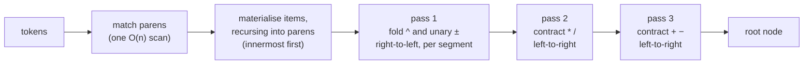
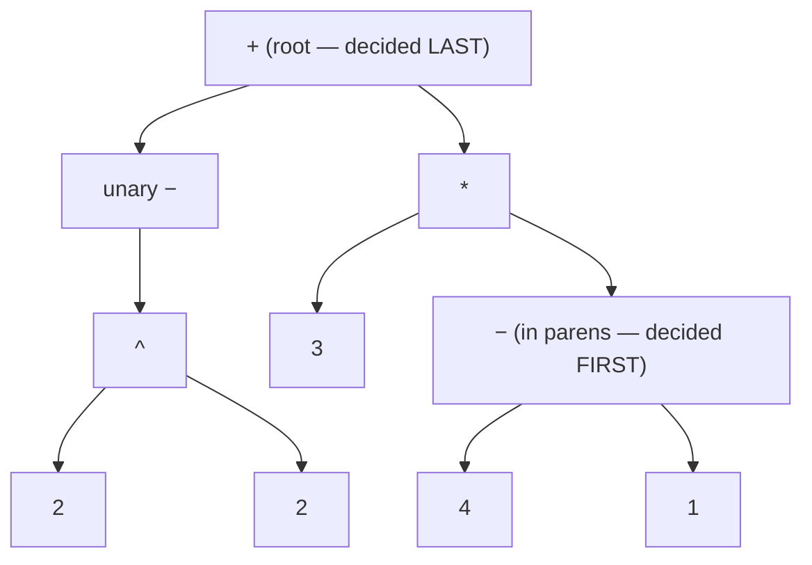
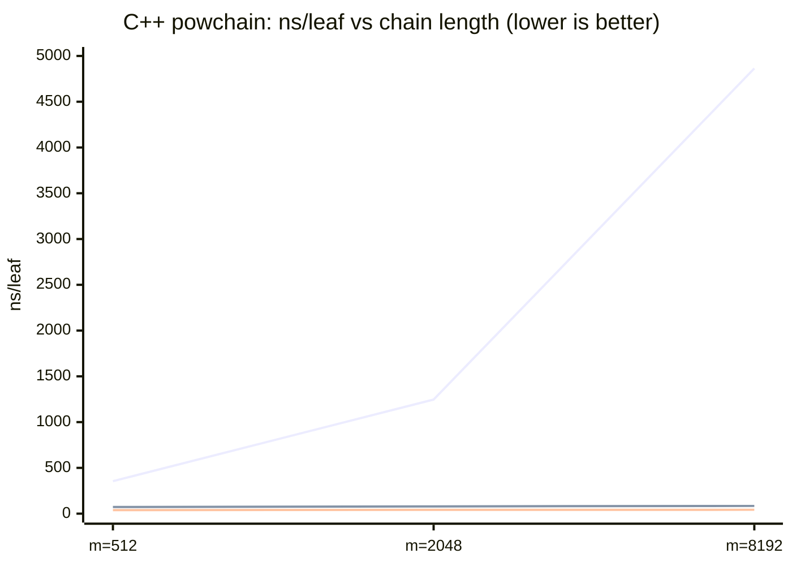

# `multipass-reverse` — bottom-up, one pass per precedence level

A **bottom-up** expression parser that reduces the *tightest-binding*
constructs first — deepest parentheses, then `^`, then `*` `/`, then `+` `-` —
until a single node remains: "multipass" in the original sense, **one
reduction pass per precedence level**, like a human simplifying on paper.

The two results, in one line each ([data](../FINDINGS.md)):
**vs the classics it is competitive** — and its fused form
(`multipass-reverse-fold`, [below](#the-fused-variant)) is the fastest tree
builder of nine in C++, Rust and Python, narrowly; **vs its top-down family it
is strictly better** — the only member whose worst case is its average case.

Implementations: [C++](../cpp/src/multipass_reverse.cpp) ·
[Rust](../rust/src/reverse.rs) ·
[Python](../python/mathparser/evaluators.py) ·
[Haskell](../haskell/src/MathParser/Strategies.hs) (`reverseMpParse`).

## Top-down vs bottom-up

Classic `multipass` (and `multipass-arena`, `multipass-bfs`, `direct-mp`) is
**top-down** divide-and-conquer: scan for the *lowest-precedence* operator —
the root, evaluated *last* — split there, recurse. `multipass-reverse` is its
exact dual:

| | top-down (`multipass*`) | bottom-up (`multipass-reverse`) |
|---|---|---|
| first decision | the **root** (loosest-binding op) | the **innermost leaves** (tightest-binding) |
| mechanism | find split → recurse on halves | one reduction sweep per precedence level |
| per-level cost | scan candidates *per split* | **one pass, no scanning** |
| recursion | per split (depth ~ tree height) | per parenthesis group only |
| result | the same tree | the same tree, built in reverse order |

Both produce **numerically identical results** (construction order — and
hence arena node indices — differs, and no test in this repo compares node
counts or tree shape directly). Equivalence is enforced by the differential
fuzz suites ([C++](../cpp/tests/fuzz_differential.cpp) ·
[Rust](../rust/tests/fuzz.rs) ·
[Python](../python/test_fuzz.py)): every strategy must agree with every other
on thousands of random and mutated inputs.

## The pipeline



The working state is a flat list of **items**: `Opd` (number, variable, or
reduced subtree), `Un` (pending prefix sign), `Op` (pending binary operator).
A `*` `/` `+` `-` is a **barrier**: the moment one arrives, everything since
the previous barrier — a *segment* of operands, prefix signs and `^` — folds
to a single `Opd`. After the scan the list is `Opd (Op Opd)*` with only
`* / + -` left; two in-place passes (`* /`, then `+ -`) contract it to one node.

## Worked example

`-2 ^ 2 + 3 * (4 - 1)` — which is **5**, because `^` binds tighter than unary
minus: `-(2²) + 3·3 = -4 + 9`.

```text
tokens:   -  2  ^  2  +  3  *  (  4  -  1  )

materialise (recursing into the parens):
  items:  [un-  2  ^  2]                       ← segment so far
  '+' is a barrier → fold segment right-to-left:
          acc = 2;  see '^' → acc = 2^2;  see un- → acc = -(2^2)   = N
  items:  [N  +]                                ← new segment opens
  items:  [N  +  3]
  '*' is a barrier → fold segment [3] → 3       (lone operand: free)
  items:  [N  +  3  *]
  '(' → recurse on "4 - 1" → S = (4-1)          (same machinery, one level down)
  items:  [N  +  3  *  S]
  end → fold segment [S] → S

pass * / :  [N  +  M]        where M = 3*S
pass + - :  [R]              where R = N+M      ← the root

evaluate:  N = -4,  S = 3,  M = 9,  R = 5
```



Top-down multipass walks this picture from the root down; `multipass-reverse`
walks it from the parens up.

## Why fold segments right-to-left?

A segment is `un* opd (^ un* opd)*`, and the grammar has two corners:
`^` is **right-associative** (`2^3^2 = 512`) and binds **tighter than unary
minus** (`-2^2 = -4`, `2^-3 = 0.125`). Folding right-to-left makes both fall
out with no recursion or look-ahead — walking leftward you always hold the
fully-folded exponent in an accumulator:

```text
2 ^ -3 ^ 2   (reversed walk)        -2 ^ 2   (reversed walk)
acc = 2                             acc = 2
'^'  → acc = 3 ^ acc   = 3^2        '^'  → acc = 2 ^ acc = 2^2
un−  → acc = -(acc)    = -(3^2)     un−  → acc = -(acc)  = -(2^2)  ✓
'^'  → acc = 2 ^ acc   = 2^(-(3^2)) ✓
```

## Complexity — and the input family where bottom-up wins

Every token enters the item list once, every item is touched once per level
pass, and paren recursion partitions the input: **Θ(n) regardless of operator
structure**. The top-down family is usually fine too — but only thanks to two
fast paths (a flat-chain fold, and a prec-1 early exit in the split scan), and
each has an input that defeats it:

| input shape | `multipass` / `-arena` / `direct-mp` | `multipass-bfs` | `multipass-reverse` |
|---|---|---|---|
| random corpus (balanced) | ~Θ(n log n) | Θ(n log n) | **Θ(n)** |
| single-precedence chain `1+2-3+…` | Θ(n) (flat-chain fold) | Θ(n) | **Θ(n)** |
| mixed-precedence chain `b^e * b^e / …` (powchain) | **Θ(n²)** † | Θ(n log n) | **Θ(n)** |
| `^`-tower then `*`-run (towerchain) | **Θ(n²)** † | **Θ(n²)** † | **Θ(n)** |
| deep parens (nestchain — *bottom-up's* worst case) | Θ(n) | Θ(n) | **Θ(n)**, flat |

† Since patched in all four languages: scans bounded at 16 candidates with a
per-depth precedence-bucket fallback caps the family at **O(n log n)** —
[before/after numbers](../FINDINGS.md#result-2--vs-its-family-strictly-better).
Bottom-up needs no budget and no fallback, because it never asks a question
whose answer lies elsewhere in the range.

Measured pre-fix on the neutral CI runner — the climbing line is quadratic
(ns/leaf ~4× per 4× length), the flat ones are not:



That was ~75–115× over top-down in C++ at m=8192 (~17× Python at m=1024, ~8×
Haskell at m=4096 — sizes differ, so ratios aren't cross-language comparable).
Post-fix the shipped binaries reproduce a ~1.5–3.6× gap (2–5× against the
fused form), still in bottom-up's favour, with no machinery on its side.

## Where it lands on the random corpora

Neutral runner, ns/leaf at n=1000 ([full tables](../FINDINGS.md#cross-language-results)):

| | C++ | Rust | Python | Haskell |
|---|--:|--:|--:|--:|
| fastest classic tree builder | `ast-arena` 71 | `ast-arena` 74 | `ast-rd` 3 244 | `ast-rd` 583 |
| **`multipass-reverse-fold`** | **69** | 76 | **3 232** | 699 |
| `multipass-reverse` | 96 | 102 | 4 505 | 852 |
| best *top-down* multipass | `direct-mp` 101 | `direct-mp` 183 | `direct-mp` 7 211 | `direct-mp` 993 |
| fastest *no-tree* classic (`direct-rd`) | 51 | 54 | 2 990 | 464 |
| **`direct-reverse`** | 50 | 57 | **2 732** | **454** |
| *`direct-scannerless`* (lexer-free control) | *37* | *34* | *2 291* | *448* |

Median of three CI runs (34136843367 / 34137622680 / 34138407724; rustc
1.98.1, unchanged from the previous batch). The buffered form beats the
top-down family in every language; the fused form is the fastest tree
builder in C++ and Python, a genuine tie with `ast-arena` in Rust (the sign
flips run to run), and second in Haskell — this batch, `ast-recursive-descent`
edges out `ast-pratt` as the fastest pointer classic on this shape. Its
no-tree twin is a real win in Python and Haskell, but in C++ and Rust it's
honestly a **tie** with `direct-recursive-descent` and `direct-shunting-yard`
at ~50–75 ns/leaf, not a lead. Both share `ast-arena`'s two structural
advantages — contiguous arena output and allocation-free parsing — and the
fused one adds a third: no recursion.

## The fused variant

`multipass-reverse-fold` (tree) and `direct-reverse` (no tree) keep the
bottom-up order — deepest parens, then `^`/unary, then `* /`, then `+ -` — but
perform the level passes *on the fly* instead of over a buffered item list.
The observation: once a `^`/unary segment has folded on a barrier, what is
left of the grammar is two left-associative levels,
`sum := term ((+|-) term)*` and `term := seg ((*|/) seg)*`, and a bottom-up
reducer for that needs two accumulators with a pending operator each, not a
list. A `*` or `/` barrier closes the segment into `term`; a `+` or `-`
barrier closes `term` into `sum` as well; a `(` pushes the accumulators on a
frame stack and a `)` pops them. Consequences:

- **no recursion, no paren-match prepass, no per-level re-scan** — every
  token is read exactly once, in order, straight from the streaming lexer
  (no token array; one token of lookahead);
- the current operand lives in a register; the segment buffer is written only
  when a `^` or a prefix sign is actually pending (a signed leaf such as `-16`
  folds straight into the register: take the leaf, then look at the one token
  after it), so on ordinary input the parse runs entirely in `val` / `term` /
  `sum`;
- the scan alternates an *operand mode* and an *operator mode*, each with its
  own small dispatch — the same context recursive descent gets from its call
  structure, without the calls;
- worst case is still the average case: nothing ever looks for a split, and a
  nesting level costs one 24-byte frame push, where recursive descent spends
  ~5 call frames (`expr → term → unary → power → primary`).

Implementations: [C++](../cpp/src/multipass_reverse_fold.cpp) (one template,
two policies) · [Rust](../rust/src/fold.rs) ·
[Python](../python/mathparser/evaluators.py) (`reverse_fold_parse`) ·
[Haskell](../haskell/src/MathParser/Strategies.hs) (`reverseFoldParse`).

### Where it lands

Neutral 4-vCPU CI runner (structured shapes at m=8192; full tables in
[FINDINGS.md](../FINDINGS.md)), median of three CI runs
(34136843367 / 34137622680 / 34138407724; rustc 1.98.1, unchanged from the
previous batch):

| C++, ns/leaf | `mp-reverse-fold` | `ast-arena` | `direct-reverse` | `direct-rd` | `direct-sy` | *`direct-scannerless`* (control) |
|---|--:|--:|--:|--:|--:|--:|
| random corpus, n=1000 | 69 | 71 | 50 | 51 | 50 | *37* |
| powchain (mixed precedence) | 32 | 38 | 27 | 27 | 28 | *26* |
| towerchain (`^` run then `*` run) | 32 | 35 | 22 | 22 | 22 | *20* |
| sumchain (single precedence) | 33 | 41 | 19 † | 20 | 28 † | *16* |
| nestchain (deep parens) | 32 | 42 | 28 | 45 | 25 | *24* |

† Sumchain is a noise-sensitive shape on this runner: `direct-sy` is volatile
across the three runs (35.7, 27.6, 18.3 — no single clean outlier) and
`direct-reverse` spikes on a different run (33.5 vs 18.8/19.0) — see the
runner-variance note in
[FINDINGS.md](../FINDINGS.md#result-2--vs-its-family-strictly-better); the
other columns on this shape were stable across all three runs.

Tree tier C++: the fastest tree builder on the random corpus (~4 % ahead of
`ast-arena` on the median, positive in all 12 size×run measurements) and on
most structured shapes, by up to 29 % depending on shape and run (nestchain
the largest gap: fold runs at ~0.76× `ast-arena`'s time there) — towerchain
is a tie this batch, one run putting fold ~1 % behind `ast-arena`. No-tree
tier C++: honestly a **three-way tie** with `direct-rd` and `direct-sy` on
the random corpus at ~50 ns/leaf. On structured shapes, against `direct-rd`
it ties powchain and towerchain (0 % to +9 % across runs — a real, if
modest, edge, not the loss earlier notes described) and is within noise on
sumchain too, apart from the one run where `direct-reverse` itself spikes
(see †); it wins nestchain by 37–44 % (`direct-rd`'s recursion pays for the
deep nesting that `direct-reverse` never recurses through); against
`direct-sy` it wins powchain (+3–9 %), ties towerchain (−1…+1 %), is a noisy
tie on sumchain (−4…+32 %, the outlier run above) and loses nestchain by
14–24 %.

Rust reproduces similar tiers, with one new exception: fold is a genuine tie
with `ast-arena` on the random corpus (sign flips run to run) and beats it
on three of four structured shapes by 3–33 % — sumchain is now a tie too
(−11…+6 %, the same single-precedence shape that is volatile in C++, see
[FINDINGS.md](../FINDINGS.md)). `direct-reverse` is a genuine tie with
`direct-rd` on the random corpus (sign flips run to run) but pulls ahead on
powchain, towerchain and sumchain (+2…+18 %) and wins nestchain outright
(+23…+36 %, `direct-rd`'s recursion costing more as the nesting deepens);
against `direct-sy` it wins every structured shape (+19…+28 %).

Python: fastest tree builder (3 232 vs `ast-rd` 3 244 ns/leaf at n=1000) and
fastest overall (`direct-reverse` 2 732 vs `direct-rd` 2 990), a real edge
over `direct-sy` repeated across runs at every size — recursive descent pays
a Python call per grammar level per leaf and the fold has none. Haskell: the
fold, like every arena form there, trails the pointer classics by ~1.1–1.6×,
and `direct-reverse` vs `direct-rd` is a noisy tie that swings sign run to
run.

The *pedagogical* `multipass-reverse` (buffered item list, three explicit
passes) stays in the suite because it is the version the walk-through above
describes; the fused form is the same algorithm with the passes interleaved.

## Scope and limits

The whole design targets one fixed, simple grammar: numbers, `+ - * / ^`,
unary ±, parens — four precedence levels. "One sweep per precedence level" is
tuned to exactly that and does not carry over for free to what real-world
parsers deal with: function calls of arbitrary arity, mixed associativity,
statements, or a language with a dozen-plus precedence levels (where the number
of sweeps grows with the level count). For those, recursive descent and Pratt
parsing stay the general-purpose default — they extend to a new construct by
adding a rule, where a per-level reduction does not. Everything measured here is
about the narrow expression-evaluation job; whether the bottom-up idea
generalizes beyond it is an open question, not a claim this repo makes.

## Implementation notes

Three things make the hot path fast (a rewrite measuring ~1.9× in C++, ~1.6×
in Python by interleaved A/B):

1. **One shared item stack** — each `reduceRange` works above its own base in
   one reusable vector and truncates on exit; recursion only per paren group.
2. **Fold-on-barrier** — segments fold right-to-left the moment a barrier
   closes them; a lone-operand segment (the common case) is a no-op.
3. **In-place level contraction** — the `* /` and `+ -` passes rewrite the
   list with a read/write index, allocating nothing.

The Haskell port gets the right-to-left walk for free: segments accumulate in
reverse order and `reduceSegRev` folds the reversed list directly.

## Reproduce

```sh
./build/adversarial_bench            # C++     (cmake --build build first)
cargo run --release --bin adversarial # Rust   (from rust/)
python3 python/adversarial.py        # Python
cd haskell && cabal run adversarial  # Haskell
```

Each prints all four shapes for all fifteen strategies. The shipped top-down
variants include the bounded-scan fix, so these reproduce the **post-fix**
gaps; the pre-fix numbers above are preserved from the last CI run before the
fix. Current numbers: [CI bench workflow](../.github/workflows/bench.yml).
