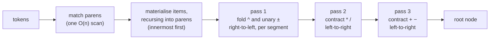
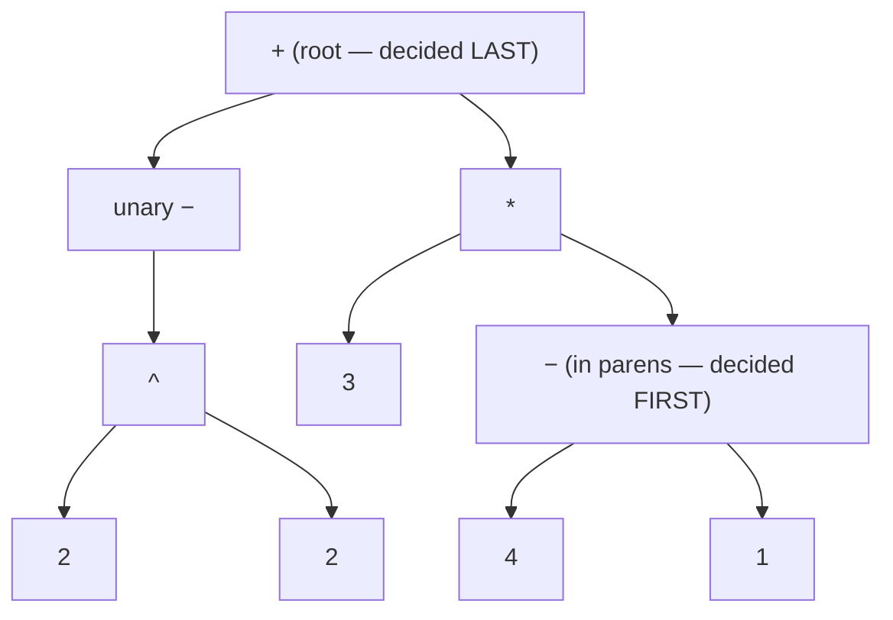
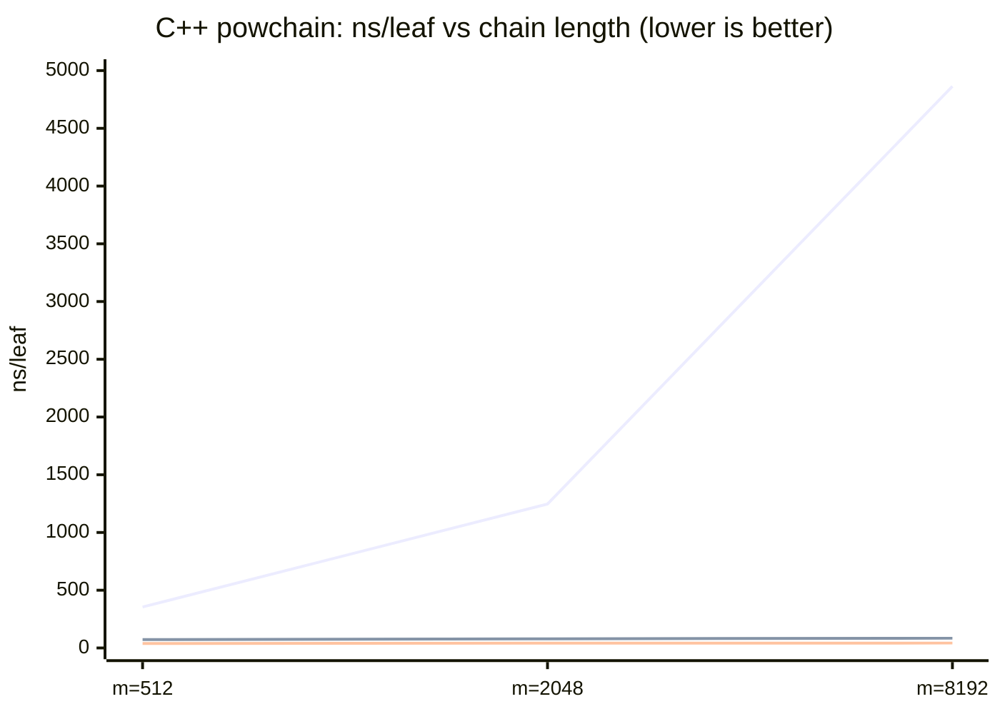

# `multipass-reverse` — bottom-up, one pass per precedence level

The newest of the [twelve strategies](../FINDINGS.md#the-twelve-strategies): a
**bottom-up** expression parser that reduces the *tightest-binding* constructs
first — deepest parentheses, then `^`, then `*` `/`, then `+` `-` —
agglomerating outward until a single node remains. It is "multipass" in the
original sense of the word: **one reduction pass per precedence level**, like a
human simplifying an expression on paper.

Implementations: [C++](../cpp/src/multipass_reverse.cpp) ·
[Python](../python/mathparser/evaluators.py) ·
[Haskell](../haskell/src/MathParser/Strategies.hs) (`reverseMpParse`).

## Top-down vs bottom-up

Classic `multipass` (and `multipass-arena`, `multipass-bfs`, `direct-mp`) is
**top-down** divide-and-conquer: scan the operator candidates for the
*lowest-precedence* one — the **root**, the operator evaluated *last* — split
the token range there, and recurse on each half. The root is *decided first*,
the leaves last.

`multipass-reverse` is its exact dual:

| | top-down (`multipass*`) | bottom-up (`multipass-reverse`) |
|---|---|---|
| first decision | the **root** (loosest-binding op) | the **innermost leaves** (tightest-binding) |
| mechanism | find split → recurse on halves | one reduction sweep per precedence level |
| per-level cost | scan candidates *per split* | **one pass, no scanning** |
| recursion | per split (depth ~ tree height) | per parenthesis group only |
| result | the same tree | the same tree, built in reverse order |

Both produce a **bit-identical arena AST** — only the order in which the tree's
internal nodes get decided differs.

## The pipeline



The working state is a flat list of **items**, each one of:

- `Opd` — an operand: a number, a variable, or an already-reduced subtree;
- `Un` — a pending prefix `+`/`-`;
- `Op` — a pending binary operator.

A `*` `/` `+` `-` operator is a **barrier**: the moment one arrives, everything
accumulated since the previous barrier — a *segment*, containing only operands,
prefix signs and `^` — is folded down to a single `Opd`. After the scan, the
item list is a flat alternation `Opd (Op Opd)*` with only `* / + -` left, and
two in-place left-to-right passes (first `* /`, then `+ -`) contract it to one
node.

## Worked example

`-2 ^ 2 + 3 * (4 - 1)` — which is **5**, because `^` binds tighter than unary
minus: `-(2²) + 3·3 = -4 + 9`.

```text
tokens:   -  2  ^  2  +  3  *  (  4  -  1  )

materialise (recursing into the parens):
  items:  [un-  2  ^  2]                       ← segment so far
  '+' is a barrier → fold segment right-to-left:
          acc = 2;  see '^' → acc = 2^2;  see un- → acc = -(2^2)   = N
  items:  [N  +]                                ← new segment opens
  items:  [N  +  3]
  '*' is a barrier → fold segment [3] → 3       (lone operand: free)
  items:  [N  +  3  *]
  '(' → recurse on "4 - 1" → S = (4-1)          (same machinery, one level down)
  items:  [N  +  3  *  S]
  end → fold segment [S] → S

pass * / :  [N  +  M]        where M = 3*S
pass + - :  [R]              where R = N+M      ← the root

evaluate:  N = -4,  S = 3,  M = 9,  R = 5
```

The tree it builds — identical to what every other strategy builds — with the
order each node is *decided*:



Top-down multipass walks this picture from the root down (`+` first, parens
last); `multipass-reverse` walks it from the parens up.

## Why fold segments right-to-left?

A segment is `un* opd (^ un* opd)*` — operands, prefix signs, and `^`. The
grammar has two corners:

- `^` is **right-associative**: `2^3^2 = 2^(3^2) = 512`;
- `^` binds **tighter than unary minus**: `-2^2 = -(2^2) = -4`, but `2^-3 = 2^(-3) = 0.125`.

Folding **right-to-left** makes both fall out with no recursion and no
look-ahead: walking leftward you always hold the *fully-folded exponent* in an
accumulator, so

```text
2 ^ -3 ^ 2   (reversed walk)        -2 ^ 2   (reversed walk)
acc = 2                             acc = 2
'^'  → acc = 3 ^ acc   = 3^2        '^'  → acc = 2 ^ acc = 2^2
un−  → acc = -(acc)    = -(3^2)     un−  → acc = -(acc)  = -(2^2)  ✓
'^'  → acc = 2 ^ acc   = 2^(-(3^2)) ✓
```

A prefix sign always applies to the power already folded to its right; a `^`
always pairs the operand on its left with the accumulator. One loop, done.

## Complexity — and the input family where bottom-up wins

Every token enters the item list once, every item is touched once per
precedence pass, and parenthesis recursion partitions the input — so
`multipass-reverse` is **Θ(n) regardless of operator structure**.

The top-down family is *usually* fine too, but only thanks to two fast paths:

1. the **flat-chain fold** — if every candidate in a range has one precedence,
   fold the chain iteratively instead of splitting;
2. the **prec-1 early exit** — the right-to-left split scan stops at the first
   `+`/`-`, since nothing binds looser.

A flat **mixed-precedence chain** with no `+`/`-` — a product of powers, like a
factored monomial `3^2 * 2^2 / 2^2 * 3^3 …` (powchain) — defeats both at once:
two precedences mean no flat fold, and no `+`/`-` means no early exit. Every
split rescans its whole range: **Θ(n²)**. The sparse-table RMQ variant
(`multipass-bfs`) answers splits in O(1) and survives — the one input family
where its precompute pays off — but still pays the O(n log n) table.

And fast path 1 is itself a linear scan: *checking* that every candidate in a
range shares one precedence costs O(k). A long `^` run followed by a `*` run
(`1^1^…^1 * 1 * 1 * …`, towerchain) leaves the same-precedence prefix in the
left sub-range after every right-end split and rereads it before each one —
**Θ(n²) even with O(1) splits**, which catches `multipass-bfs` too.

| input shape | `multipass` / `-arena` / `direct-mp` | `multipass-bfs` | `multipass-reverse` |
|---|---|---|---|
| random corpus (balanced) | ~Θ(n log n) | Θ(n log n) | **Θ(n)** |
| single-precedence chain `1+2-3+…` | Θ(n) (flat-chain fold) | Θ(n) | **Θ(n)** |
| mixed-precedence chain `b^e * b^e / …` | **Θ(n²)** † | Θ(n log n) | **Θ(n)** |
| `^`-tower then `*`-run `1^1^…^1*1*1…` | **Θ(n²)** † | **Θ(n²)** † | **Θ(n)** |

† These holes have since been patched in all three languages: every linear
scan is bounded at 16 candidates and falls back to per-depth, per-precedence
sorted position arrays (binary search), capping the whole family at
**O(n log n)** on any input — see the
[FINDINGS section](../FINDINGS.md#the-fix-bounded-scans--precedence-buckets)
for before/after numbers. The structural point is unchanged: bottom-up needs
no budget and no fallback, because it never asks a question whose answer lies
elsewhere in the range.

Measured on the neutral 4-vCPU GitHub runner **before that fix**
(C++, ns/leaf on the power chain).
The climbing curve is top-down `multipass-arena` — ns/leaf growing ~4× per 4×
length means quadratic total cost. The two flat lines hugging the axis are
`multipass-bfs` (RMQ, ~72–84) and `multipass-reverse` (~39–43):



Cross-language, at the largest size each runtime was measured at (same
pre-fix run — all three languages have since been patched, see †):

| family member | C++ m=8192 | Python m=1024 | Haskell m=4096 |
|---|--:|--:|--:|
| top-down (three variants) | 3 236–4 864 | 52 368–53 140 | 9 757–10 943 |
| `multipass-bfs` (RMQ) | 84 | 13 709 | 3 010 |
| **`multipass-reverse`** | **43** | **3 135** | **1 302** |

**~75–115× (C++ pre-fix), ~17× (Python), ~8× (Haskell) over top-down — growing
with n — and ~2–4× over the RMQ variant.** On the single-precedence control
chain the whole family stays linear, isolating *mixed precedence* as the
trigger. After the C++ bucket fix plus iterator-passing, the gap narrows to ~2× for the
arena and direct forms (~4× for pointer-AST `multipass`) — still in bottom-up's
favour, with no fallback machinery needed.

## Where it lands on the random corpora

Neutral runner, ns/leaf at n=1000 (full tables in
[FINDINGS.md](../FINDINGS.md#cross-language-results)):

| | C++ | Python | Haskell |
|---|--:|--:|--:|
| fastest tree builder | `ast-arena` 71 | `ast-rd` 2 356 | `ast-rd` 1 007 |
| **`multipass-reverse`** | **85** | **3 318** | **1 422** |
| best *top-down* multipass | `direct-mp` 89 | `direct-mp` 5 252 | `multipass` 1 368 |
| fastest *no-tree* strategy (`direct-rd`) | 53 | 2 122 | 1 105 |

Best of the multipass family in Python by ~1.6× at n=1000 (growing to ~1.9× at
n=10000); in C++ within ~5% of `direct-mp` across sizes (85 vs 89 at n=1000,
97 vs 100 at n=10000 — and `direct-mp` builds *no tree* at all); effectively a
tie in Haskell. In C++ it is also the **second-fastest tree builder of all
eight** — ahead of every pointer-AST parser — because it shares `ast-arena`'s
two structural advantages: a contiguous arena output and (after the hot-path
rewrite below) no per-node allocation during parsing.

## Implementation notes

Three things make the hot path fast (added in a rewrite that measured ~1.9×
in C++ and ~1.6× in Python by interleaved A/B, parity in Haskell):

1. **One shared item stack.** Every `reduceRange` works above its own base
   index in a single reusable vector and truncates back on exit — stack
   discipline, zero per-range allocation. The only recursion left is per
   parenthesis group.
2. **Fold-on-barrier.** Segments are folded right-to-left *the moment* a
   `* / + -` barrier closes them (the loop above), so there is no separate
   "split into segments" pass and no per-segment list. A lone-operand segment —
   the common case — is a no-op.
3. **In-place level contraction.** The `* /` and `+ -` passes rewrite the item
   list in place with a read/write index, allocating nothing.

The Haskell version expresses the same idea idiomatically: segments accumulate
naturally in reverse order, and `reduceSegRev` folds that reversed list
directly — the right-to-left walk for free.

## Reproduce

```sh
./build/adversarial_bench          # C++   (cmake --build build first)
python3 python/adversarial.py      # Python
cd haskell && cabal run adversarial  # Haskell
```

Each prints the power chain (mixed precedence) and the control chain (single
precedence) for all twelve strategies; the numbers above are from the
[CI bench workflow](../.github/workflows/bench.yml) on a neutral GitHub runner.
