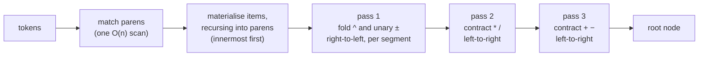
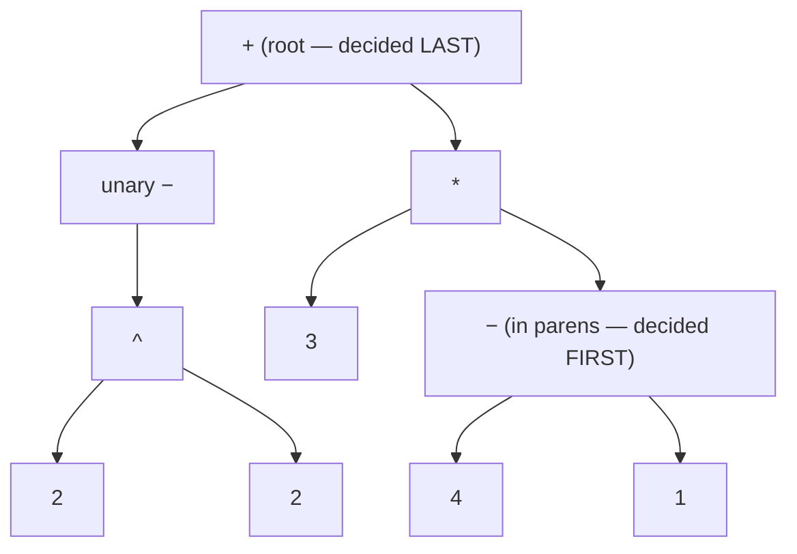
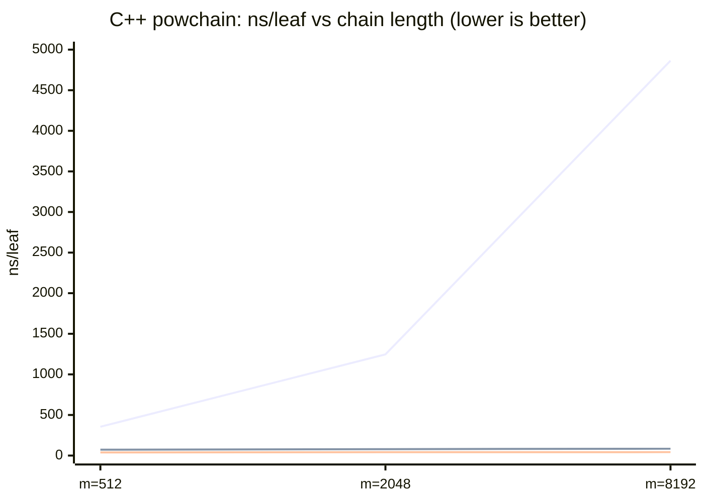

# `multipass-reverse` — bottom-up, one pass per precedence level

A **bottom-up** expression parser that reduces the *tightest-binding*
constructs first — deepest parentheses, then `^`, then `*` `/`, then `+` `-` —
until a single node remains: "multipass" in the original sense, **one
reduction pass per precedence level**, like a human simplifying on paper.

The two results, in one line each ([data](../FINDINGS.md)):
**vs the classics it is competitive** — second-fastest tree builder of eight
in C++, ahead of every pointer-AST parser; **vs its top-down family it is
strictly better** — the only member whose worst case is its average case.

Implementations: [C++](../cpp/src/multipass_reverse.cpp) ·
[Python](../python/mathparser/evaluators.py) ·
[Haskell](../haskell/src/MathParser/Strategies.hs) (`reverseMpParse`).

## Top-down vs bottom-up

Classic `multipass` (and `multipass-arena`, `multipass-bfs`, `direct-mp`) is
**top-down** divide-and-conquer: scan for the *lowest-precedence* operator —
the root, evaluated *last* — split there, recurse. `multipass-reverse` is its
exact dual:

| | top-down (`multipass*`) | bottom-up (`multipass-reverse`) |
|---|---|---|
| first decision | the **root** (loosest-binding op) | the **innermost leaves** (tightest-binding) |
| mechanism | find split → recurse on halves | one reduction sweep per precedence level |
| per-level cost | scan candidates *per split* | **one pass, no scanning** |
| recursion | per split (depth ~ tree height) | per parenthesis group only |
| result | the same tree | the same tree, built in reverse order |

Both produce a **structurally identical tree** (construction order — and hence
arena node indices — differs). Equivalence is enforced by the differential
fuzz suites ([C++](../cpp/tests/fuzz_differential.cpp) ·
[Python](../python/test_fuzz.py)): every strategy must agree with every other
on thousands of random and mutated inputs.

## The pipeline



The working state is a flat list of **items**: `Opd` (number, variable, or
reduced subtree), `Un` (pending prefix sign), `Op` (pending binary operator).
A `*` `/` `+` `-` is a **barrier**: the moment one arrives, everything since
the previous barrier — a *segment* of operands, prefix signs and `^` — folds
to a single `Opd`. After the scan the list is `Opd (Op Opd)*` with only
`* / + -` left; two in-place passes (`* /`, then `+ -`) contract it to one node.

## Worked example

`-2 ^ 2 + 3 * (4 - 1)` — which is **5**, because `^` binds tighter than unary
minus: `-(2²) + 3·3 = -4 + 9`.

```text
tokens:   -  2  ^  2  +  3  *  (  4  -  1  )

materialise (recursing into the parens):
  items:  [un-  2  ^  2]                       ← segment so far
  '+' is a barrier → fold segment right-to-left:
          acc = 2;  see '^' → acc = 2^2;  see un- → acc = -(2^2)   = N
  items:  [N  +]                                ← new segment opens
  items:  [N  +  3]
  '*' is a barrier → fold segment [3] → 3       (lone operand: free)
  items:  [N  +  3  *]
  '(' → recurse on "4 - 1" → S = (4-1)          (same machinery, one level down)
  items:  [N  +  3  *  S]
  end → fold segment [S] → S

pass * / :  [N  +  M]        where M = 3*S
pass + - :  [R]              where R = N+M      ← the root

evaluate:  N = -4,  S = 3,  M = 9,  R = 5
```



Top-down multipass walks this picture from the root down; `multipass-reverse`
walks it from the parens up.

## Why fold segments right-to-left?

A segment is `un* opd (^ un* opd)*`, and the grammar has two corners:
`^` is **right-associative** (`2^3^2 = 512`) and binds **tighter than unary
minus** (`-2^2 = -4`, `2^-3 = 0.125`). Folding right-to-left makes both fall
out with no recursion or look-ahead — walking leftward you always hold the
fully-folded exponent in an accumulator:

```text
2 ^ -3 ^ 2   (reversed walk)        -2 ^ 2   (reversed walk)
acc = 2                             acc = 2
'^'  → acc = 3 ^ acc   = 3^2        '^'  → acc = 2 ^ acc = 2^2
un−  → acc = -(acc)    = -(3^2)     un−  → acc = -(acc)  = -(2^2)  ✓
'^'  → acc = 2 ^ acc   = 2^(-(3^2)) ✓
```

## Complexity — and the input family where bottom-up wins

Every token enters the item list once, every item is touched once per level
pass, and paren recursion partitions the input: **Θ(n) regardless of operator
structure**. The top-down family is usually fine too — but only thanks to two
fast paths (a flat-chain fold, and a prec-1 early exit in the split scan), and
each has an input that defeats it:

| input shape | `multipass` / `-arena` / `direct-mp` | `multipass-bfs` | `multipass-reverse` |
|---|---|---|---|
| random corpus (balanced) | ~Θ(n log n) | Θ(n log n) | **Θ(n)** |
| single-precedence chain `1+2-3+…` | Θ(n) (flat-chain fold) | Θ(n) | **Θ(n)** |
| mixed-precedence chain `b^e * b^e / …` (powchain) | **Θ(n²)** † | Θ(n log n) | **Θ(n)** |
| `^`-tower then `*`-run (towerchain) | **Θ(n²)** † | **Θ(n²)** † | **Θ(n)** |
| deep parens (nestchain — *bottom-up's* worst case) | Θ(n) | Θ(n) | **Θ(n)**, flat |

† Since patched in all three languages: scans bounded at 16 candidates with a
per-depth precedence-bucket fallback caps the family at **O(n log n)** —
[before/after numbers](../FINDINGS.md#result-2--vs-its-family-strictly-better).
Bottom-up needs no budget and no fallback, because it never asks a question
whose answer lies elsewhere in the range.

Measured pre-fix on the neutral CI runner — the climbing line is quadratic
(ns/leaf ~4× per 4× length), the flat ones are not:



That was ~75–115× over top-down in C++ at m=8192 (~17× Python at m=1024, ~8×
Haskell at m=4096 — sizes differ, so ratios aren't cross-language comparable).
Post-fix the shipped binaries reproduce a ~1.7–3.6× gap, still in bottom-up's
favour, with no machinery on its side.

## Where it lands on the random corpora

Neutral runner, ns/leaf at n=1000 ([full tables](../FINDINGS.md#cross-language-results)):

| | C++ | Python | Haskell |
|---|--:|--:|--:|
| fastest tree builder | `ast-arena` 83 | `ast-sy` 3 204 | `ast-rd` 1 271 |
| **`multipass-reverse`** | **98** | **4 374** | **1 730** |
| best *top-down* multipass | `direct-mp` 102 | `direct-mp` 7 007 | `multipass` 1 624 |
| fastest *no-tree* strategy (`direct-rd`) | 62 | 2 965 | 1 465 |

Best of the family in Python by ~1.6× (→ ~1.8× at n=10000); a dead tie with
`direct-mp` in C++ at n=10000 (114 vs 114 — and `direct-mp` builds no tree);
effectively a tie in Haskell. Second-fastest tree builder of eight in C++ —
it shares `ast-arena`'s two structural advantages: contiguous arena output and
allocation-free parsing.

## Implementation notes

Three things make the hot path fast (a rewrite measuring ~1.9× in C++, ~1.6×
in Python by interleaved A/B):

1. **One shared item stack** — each `reduceRange` works above its own base in
   one reusable vector and truncates on exit; recursion only per paren group.
2. **Fold-on-barrier** — segments fold right-to-left the moment a barrier
   closes them; a lone-operand segment (the common case) is a no-op.
3. **In-place level contraction** — the `* /` and `+ -` passes rewrite the
   list with a read/write index, allocating nothing.

The Haskell port gets the right-to-left walk for free: segments accumulate in
reverse order and `reduceSegRev` folds the reversed list directly.

## Reproduce

```sh
./build/adversarial_bench            # C++   (cmake --build build first)
python3 python/adversarial.py        # Python
cd haskell && cabal run adversarial  # Haskell
```

Each prints all four shapes for all twelve strategies. The shipped top-down
variants include the bounded-scan fix, so these reproduce the **post-fix**
gaps; the pre-fix numbers above are preserved from the last CI run before the
fix. Current numbers: [CI bench workflow](../.github/workflows/bench.yml).
